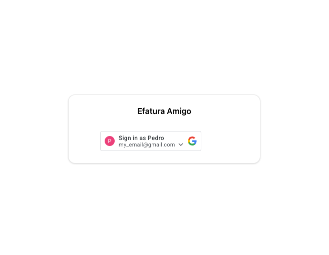
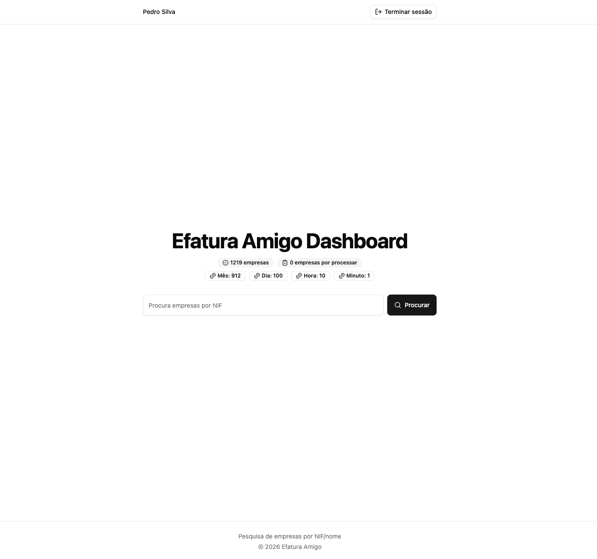
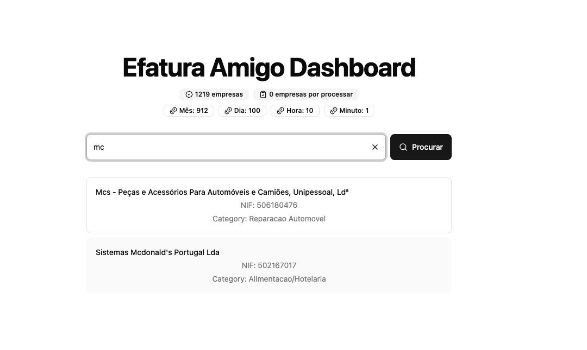

+++
date = '2026-09-16T14:15:28+01:00'
summary = 'Dashboard to visualise data that powers Efatura Amigo browser extension'
draft = false
title = 'Efatura Amigo Dashboard'
keywords = ["NIF", "Efatura", "Portugal", "TypeScript", "Chrome extension", "Firefox addon", "AWS", "Dynamo", "Algolia", "Cloudflare", "Zustand"] 
tags = ["efatura", "cloudflare", "react", "typescript", "chrome-extension", "firefox-addon", "web-development", "aws", "dynamo", "algolia", "cloudflare", "zustand"] 
categories = ["Projects"] 
author = "Pedro Silva"
ShowBreadCrumbs = true
ShowReadingTime = true
ShowShareButtons = true

[cover]
image = "images/dashboard.png"
alt = "Efatura Amigo Dashboard showing a table of saved companies"
caption = "Efatura Amigo Dashboard showing a table of saved companies"
relative = true
+++

# 🚀 Quick Links

**GitHub Repository**: [Dashboard source code]([https://github.com/PedroS11/efatura-amigo-fe](https://github.com/PedroS11/efatura-amigo-fe)) &
[Backend source code]([https://github.com/PedroS11/efatura-amigo-be](https://github.com/PedroS11/efatura-amigo-be))

---

After creating the browser extension and the backend that powers it, I found it annoying to log in to AWS -> Dynamo ->
Explore items just to view my saved companies, plus the Dynamo costs to read anything. So creating a private dashboard
where I could easily do it seemed like the next step.

# Architecture

## Backend

### Authentication

Since I'm running this on free tier services, the new endpoints must be behind authentication where I can control who can
access it.
To make it easier, the Google authentication method was the quickest and easiest solution. The frontend would get a Google
Identification Token, send it to the login endpoint, and a session cookie would be returned.

The session cookie needed to be saved so I could control whether it was still valid, so it was between Dynamo and Redis.
Since I already had the structure to create multiple Dynamo tables in my stack and I was the only one accessing it, Dynamo was more than capable.

```
export type Session = {
  sub: string;
  email?: string;
  name?: string;
  expiresAt: number;
  id: string;
};
```

*Representation of a session item in Dynamo*

With a table to hold the sessions, the login endpoint would then be responsible for:

- Validating that the identification token belongs to a valid Google account and was generated using the Efatura Amigo Dashboard Google Authentication client ID
- Generating a random session id
- Saving the session in its table
- Returning 200 with the cookie set in the headers

In order to protect all the private endpoints, I created an [AWS Lambda authorizer](https://github.com/PedroS11/efatura-amigo-be/blob/main/src/application/authorizer/index.ts) that sits in front of all of them. It
gets the session cookie, checks in Dynamo if it exists and isn't expired. On success, it returns true with the Google info; if not, it returns false.

### Logout

The logout was a straightforward lambda that would get the sessionId from the cookie, delete it from Dynamo and send back
a delete-cookie header.

### Me

In order to validate my session and get my information to display on the dashboard, I created a new endpoint
that receives the session cookie, goes through the authorizer and, on success, returns the Google data.

### Search companies

I needed to quickly search the companies, including by name, so an indexer was what I needed. In this case,
I had a lot of experience with Algolia, and since it had a free tier that would fit the load I needed, I decided to go with it.

So the data saved would have the same format as in Dynamo:

```
export enum Categories {
  Saude,
  Ginasio,
  Educacao,
  Imoveis,
  Lares,
  Outros,
  "Reparacao Automovel",
  "Reparacao Motas",
  "Alimentacao/Hotelaria",
  Cabeleireiro,
  "Animais de Estimacao",
  Transportes,
  "Jornais e Revista",
  "Comercio a retalho de livros",
  "Atividades artisticas e literarias",
  "Atividades dos museus e monumentos historicos"
}

export interface Company {
  nif: number;
  name: string;
  category?: Categories;
  caeRev3?: string;
  updatedAt: number;
}
```

In Algolia, you can set which attributes are searchable, so I chose `nif` and `name`.

To feed Algolia with company data, on every Dynamo update I also needed to send the data to Algolia to guarantee consistency.

### Metadata

The Nif-pt API has strict limits on the amount of calls I can do, as explained [here](https://blog.pedroosilva.dev/posts/efatura-amigo/#architecture-design).
So having the number of requests I'm still able to make, via the /credits endpoint, displayed would be a nice-to-have.

There's also more metadata that would be useful to display: the number of companies saved and the number still to be processed.
DynamoDB has a method called DescribeTable that returns this approximate data.

So having an endpoint that aggregates all this information would bring a lot of useful information to the dashboard.

## Frontend

In order to build the UI I picked the most common and free technologies:

- [Vite](https://vite.dev/) for React
- [tailwind](http://tailwindcss.com/) + [shadcn](https://ui.shadcn.com/) for the UI components
- [@react-oauth/google](https://github.com/MomenSherif/react-oauth) to handle the Google form and authentication flow
- [Zustand](https://zustand.docs.pmnd.rs/) for store management
- Cloudflare Pages to host the website
- Cloudflare Workers to handle rate limits and forward requests

### Login

The dashboard would then have a Login page.

<p align="center">
    
    <small>Login page</small>
</p>

### Dashboard

<p align="center">
    
    <small>Dashboard page</small>
</p>

<p align="center">
    
    <small>Search results</small>
</p>


