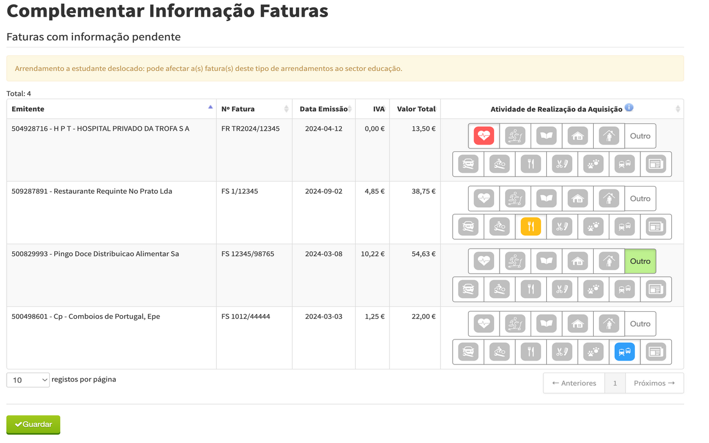
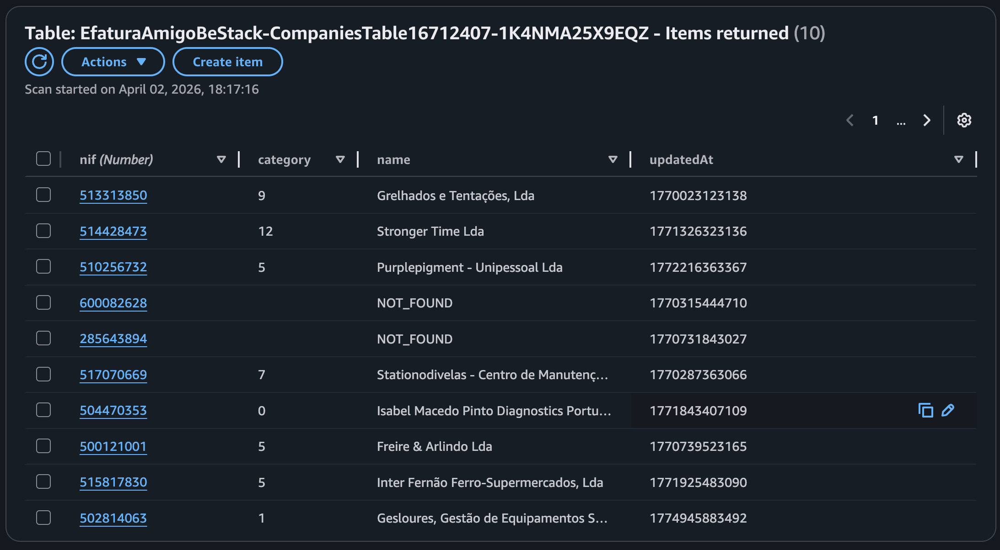

+++
date = '2026-04-02T09:39:45+01:00'
summary = 'A browser extension that, when you open your Efatura validation page, automatically selects a category for each invoice.'
draft = false
title = 'Efatura Amigo'
keywords = ["NIF", "Efatura", "Portugal", "TypeScript", "Chrome extension", "Firefox addon", "Manifest V3"]
tags = ["efatura", "browser-extension", "react", "typescript", "chrome-extension", "firefox-addon", "manifest-v3", "web-development"]
categories = ["Projects"]
author = "Pedro Silva"
ShowBreadCrumbs = true
ShowReadingTime = true
ShowShareButtons = true

[cover]
image = "images/efatura.png"
alt = "Browser extension that automatically selects a category for each invoice on the Efatura validation page"
caption = "Browser extension that automatically selects a category for each invoice on the Efatura validation page"
relative = true
+++

## 🚀 Quick Links

**Chrome Web Store**: [Install on Chrome/Edge/Brave](https://chromewebstore.google.com/detail/mefalgjilgiijibpafochindaickeabj)

**Firefox Add-ons**: [Install on Firefox](https://addons.mozilla.org/pt-PT/firefox/addon/efatura-amigo/)

**GitHub Repository**: [Extension source code](https://github.com/PedroS11/efatura-amigo) and [API source code](https://github.com/PedroS11/efatura-amigo-be)

---

In Portugal, there's a governmental portal called Efatura where you can see every invoice you have
requested. When you pay for a service, you can give the service provider your fiscal number (NIF); an invoice is
issued and listed on the portal. Then, each invoice is assigned a category:
- Saúde (Health)
- Ginásio (Gym)
- Educação (Education)
- Casa (House)
- Lar (Nursing Home)
- Mecânica Automóvel (Car Workshop)
- Mecânica Motociclo (Motorbike Workshop)
- Restaurantes e Alojamento (Restaurant and Accommodation)
- Cabeleireiro (Barbershop)
- Veterinário (Veterinary)
- Transporte (Transport)
- Revistas e Jornais (Magazines and Journals)
- Outros (Others)

This assignment is done automatically for most services, but some companies offer services that fit more than one category,
are misconfigured, or, for fiscal reasons, belong to larger groups active in several areas,
so the government system does not assign a category.
In those cases, you get a special page on the portal to assign the category manually.

On it, the only identifiable fields are the company's NIF and name. Sometimes the fiscal name does not match the trading name,
so your only option is to look up the NIF and figure out what the business actually is.
For example, my local McDonald's is listed as "Regiquatro - Restaurante, Lda". 

## Version 1.0.0

At some point, I accessed the portal and had 50+ invoices to validate, so I decided to create a browser extension to help me.
The idea was to define a set of keywords per category; the extension would match the fiscal name against those keywords
and, when it found a match, click the corresponding category. Not every invoice would match, but catching the obvious cases
would still save a lot of time.

The extension was super basic: install from the store and that was it. It worked well and saved me a lot of repetitive work, so I kept
it updated for three years.

## Version 1.2.0

Recently, I learned that every company has a NIF, a name, and a list of codes called CAEs. The CAEs describe which activities the company performs.
I thought I could create a mapper from CAEs to categories, so I started to investigate how to get the CAEs by NIF.

### API limitations
After a lot of digging, I was left with only a few options.

#### SICAE
I found a government portal called [SICAE](http://www.sicae.pt/Consulta.aspx) that lets you search by NIF and get the CAEs. I emailed them asking if they had an API,
but they said they only offer the portal, not an API.
That would mean building a scraper for the search.

#### EInforma
There are many third-party sites where you can search by NIF and get CAEs, such as [EInforma](https://www.einforma.pt), but all of them require
a scraper.

#### Nif.pt
Then I found [Nif.pt](https://www.nif.pt/api/), another third-party site that exposes CAEs by NIF through an API.
The free tier was quite limited: 1 request per minute, 10 per hour, 20 per day.

While developing, I considered scraping SICAE but decided against the legal risk; the Nif.pt
option was enough for my needs.

### Architecture design

    
    <small>Architecture diagram</small>

With the API chosen, I created a new repo for the backend consumed by the extension.
The plan was an endpoint the extension calls with the NIF as a path parameter, returning a category when one is known.

I use AWS daily, so I deployed on the AWS Free Tier with DynamoDB, Lambda, and API Gateway.
Since I was building from scratch, I picked recent tooling:

- **aws-cdk**: to define the stack

- **TypeScript**: application code

- **vitest**: unit tests

- **esbuild**: fast bundling

- **biome**: formatting

- **GitHub Actions**: deployments

I use a DynamoDB table `CompaniesTable` for the NIF-to-category mapping. 
The partition key is the NIF. I store the category, the last update timestamp and, for readability, the company name. When no category can be resolved, I still record that so the same NIF is not reprocessed forever.

    
    <small>Companies table structure</small>

Whenever a lookup misses `CompaniesTable`, the Lambda adds the NIF to `UnprocessedCompaniesTable` with an `updatedAt` timestamp.

If the external API were less constrained, I would use a queue and process new NIFs quickly. As it is, entries stay in DynamoDB and a cron runs every minute, processing one NIF at a time.

To stay within rate limits, before calling Nif.pt's search I call another of their endpoints to see if the quota is exhausted; if so, I exit and wait for the next run.
Otherwise I call the search API, take the first CAE from the list, run it through my CAE-to-category mapper, and on success write to `CompaniesTable` and remove the NIF from `UnprocessedCompaniesTable`. Errors go to a Telegram channel so I notice failures quickly.

With only about 40 extension users, I do not expect a huge backlog of NIFs, so this slow async path was the best free option. The extension calls the new API first; if no category comes back, the original keyword logic still runs. That version has been live since January and has been working well.

