+++
date = '2026-03-09T17:54:18Z'
lastmod = '2026-03-25T12:00:00Z'
draft = false
title = 'Building Twitch Live Extension: From React to 20k+ Users'
summary = 'Complete development journey of a Twitch browser extension built with React and TypeScript. Learn about Twitch API integration, Manifest V3 migration, and scaling to 20k+ users across Chrome and Firefox.'
description = 'Learn how to build a successful Twitch browser extension with React, TypeScript, and Twitch API. Covers development challenges, Manifest V3 migration, and scaling to thousands of users.'
keywords = ["Twitch extension", "browser extension development", "React extension", "TypeScript extension", "Twitch API", "Chrome extension", "Firefox addon", "Manifest V3", "web extension tutorial"]
tags = ["browser-extension", "twitch-api", "react", "typescript", "chrome-extension", "firefox-addon", "manifest-v3", "web-development", "javascript", "api-integration", "notification-api", "oauth"]
categories = ["Projects", "Tutorial"]
author = "Pedro Silva"
ShowBreadCrumbs = true
ShowReadingTime = true
ShowShareButtons = true
ShowToc = true
TocOpen = false

[cover]
image = "twitch-extension-cover.jpg"
alt = "Twitch Live Extension browser interface showing live streamers"
caption = "Twitch Live Extension helping users track their favorite streamers"
relative = true
+++

**Twitch Live Extension** is a comprehensive browser extension built with **React** and **TypeScript** that helps users 
track when their favorite Twitch streamers are live and sends go-live notifications. 
With over **20,000 users** across multiple browsers, it's become one of the most popular Twitch tracking extensions available.

## 🚀 Quick Links

**Chrome Web Store**: [Install on Chrome/Edge/Brave](https://chromewebstore.google.com/detail/twitch-live-extension/nlnfdlcbnpafokhpjfffmoobbejpedgj)

**Firefox Add-ons**: [Install on Firefox](https://addons.mozilla.org/en-US/firefox/addon/twitch-live-extension/)

**GitHub Repository**: [View Source Code](https://github.com/PedroS11/twitch-live-extension)

## Key Features

✅ **Near real-time notifications** when streamers go live  
✅ **Automatic follower sync** via Twitch OAuth  
✅ **Live viewer counts** and stream information  
✅ **Cross-browser compatibility** (Chrome, Firefox, Edge, Brave)  
✅ **Manifest V3 compliant** for future-proofing  
✅ **Search functionality** for large follower lists

---

## The Development Journey

### The Initial Idea
Back in 2019, we were all asked to stay at home due to the COVID-19 pandemic. So I ended up spending a lot of time on Twitch and
one day I had an idea to create a simple extension so I could check if my favorite streamers were live.

I had never created a browser extension before nor worked with the Twitch API, so it seemed like the perfect fit.

### Building the Proof of Concept

After checking the Twitch API documentation, I could check by username if a streamer was live or not.
So, I used create-react-app to create a simple extension, added jQuery + Bootstrap (which I knew a bit from university),
hardcoded my favorite streamers, and the extension would check their status and display them if live.

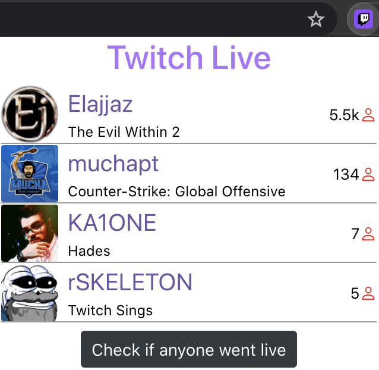
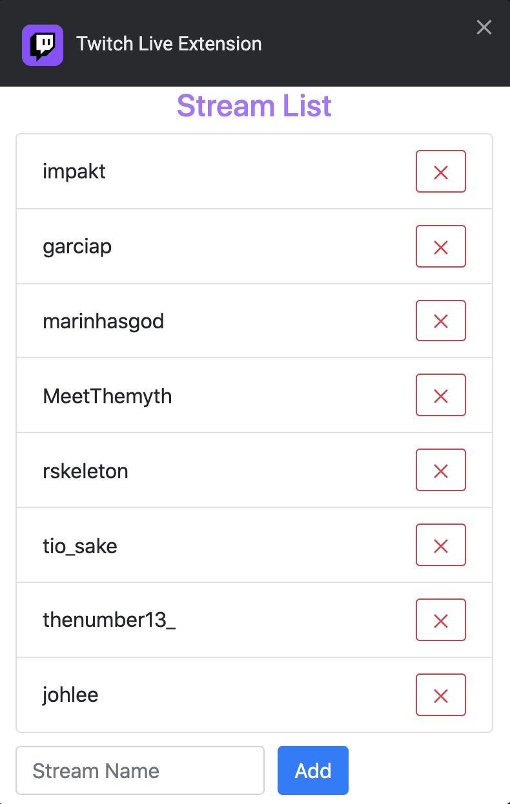

Everything was working fine, so I uploaded it to the Chrome Web Store and Firefox Add-ons and shared it with my friends and 
Portuguese streamers that I had made friends with.

### Version 2.0 - Twitch OAuth Integration
This worked pretty well but had a major issue: it forced users to manually input the streamers' usernames.
So, I decided to add Twitch auth integration so the extension would get all the followers of the account and check if any of them were live.
The functionality was working perfectly, but the extension wasn't that beautiful. I decided to add Material UI for the UI
and Redux Toolkit for state management.

And version 2.0.0 was released! I had back then a few hundred users of it.

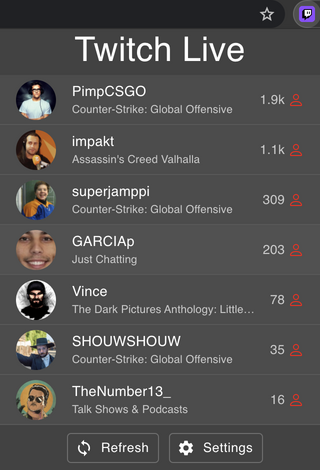
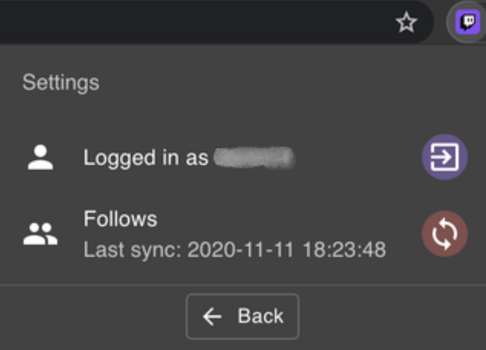

### Version 2.2 - Real-time Notifications System

The feedback I got was really good and new features started to be requested. The users wanted to receive a notification
when a streamer went live, so I decided to add browser notifications for it.

#### Technical Challenge: Building Notifications Without a Backend
The Twitch API sends notifications when a streamer goes live, but you need to subscribe to a webhook and can only track 3 streamers per account.
Since this was a free extension, I wanted to make it work without any backend because that would add costs to the extension.

So the other option I had was: I have the list of streamers the user follows, and if I save them locally,
I can create a polling mechanism that every 3 minutes would check if any of them are live. Twitch returns the stream start
timestamp, so if they started less than 3 minutes before, that meant it was a new streamer going live, and I'd send a notification for every new one. 

Browsers have an alarm API so I used it to schedule the polling strategy. I found out while working on this
that I should use a background service worker to deal with the alarms and the flow to fetch the Twitch auth token.
Then, I'd send messages between the background service worker and the popup page to make the code cleaner. This way, 
when the popup was opened and there was no token in the local storage, the background script would:
- fetch the token
- send it to the popup page
- popup saves it in local storage
- every time the popup opens, it fetches from the storage

If the token expired, I had an axios interceptor to refresh the token with a retry policy.

Since not everyone was interested in the "went live" notifications, I added a toggle in the settings page.

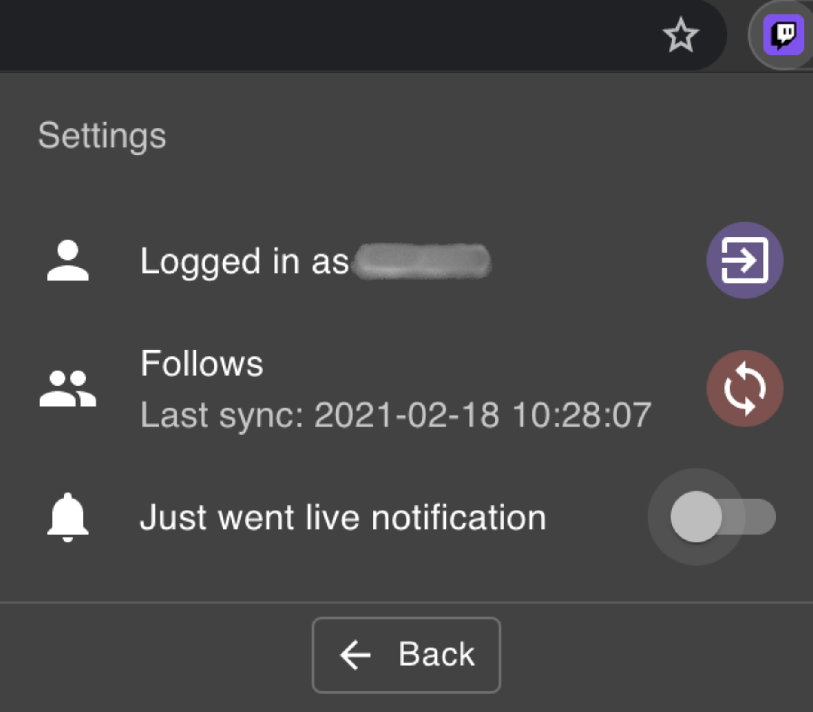
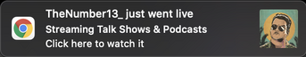

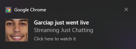

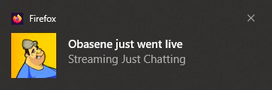

### Version 3.0 - Twitch API Optimization

Twitch updated their API and added a new endpoint to fetch all live streamers a user follows.
This endpoint would remove the need to save the followers locally and check if any of them were live, one by one.
So, the alarm logic would only call Twitch to get all the live streamers, do the same "started at timestamp" logic, and send notifications.

### Version 3.1 - Browser Badge Integration

I found that every extension icon can have a smaller badge to display up to 3 characters, and 
since I knew how many streamers were live every 3 minutes, I could update the badge with the number of live streamers.
It was quite easy but brought a lot of useful information without needing to open the extension.

### Version 3.2 - Stream Duration & Enhanced UI

I use the BetterTTV extension to display some information about the streamer on their Twitch page. One of the things
it shows is how long the streamer has been live. Twitch returns the start time of the stream, so I could calculate the elapsed time
since the stream started and display it below the streamer name.

And I also have the stream title, so it would be useful if, on hovering over the streamer name, I could see the title of the stream.
So, I released a new version with all these features.

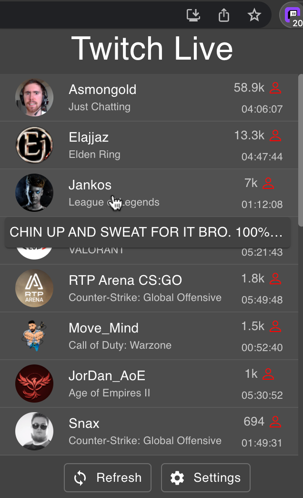

### Version 3.3 - Discover New Streamers

As more feedback was provided on the issues page, I added a new tab to the extension to show the top streamers live on Twitch.
It would fetch the top 10 and with infinite scroll would load more.

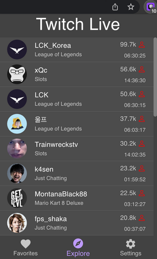

### Version 4.0 - Manifest V3 Migration & Modern Architecture

Google Chrome introduced Manifest Version 3 and gave a deadline to migrate to it; otherwise, current extensions would 
not be updated anymore.
So, I took this opportunity to migrate from Redux Toolkit to Zustand and added webpack instead of the create-react-app build.

#### Cross-Browser Compatibility Challenge
In order to use the extension on Firefox, I was using [webextension-polyfill-ts](https://github.com/Lusito/webextension-polyfill-ts)
to guarantee Chromium and Firefox compatibility.

Starting from version 2.2, the background script would fetch the token and send it to the popup page.
However, the polyfill didn't support Manifest Version 3 back then, and using Firefox MV3, the communication between popup and background
was broken, so I couldn't send the token back. Since I couldn't find a proper fix,
Firefox was left without the new features and stuck on version 3.3 for over 3 years until it got fixed recently.

### Version 4.1 - Enhanced User Experience
Something that never crossed my mind was that some users might follow a lot of people, and even
if a small part of them go live, the Favorites tab would be really long. When I thought about this use case,
I decided to add a search bar to the favorites page.

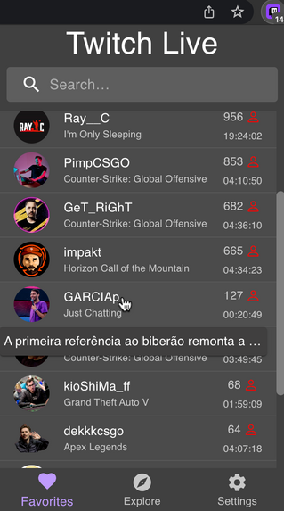

### Version 4.3 - Firefox Manifest V3 Support
After some minor features were added, in 2026 using AI tools, I was able to change the way Popup/Background communicated 
to make the token available to the popup. 

I tried multiple ways to make it work, and the final and only solution was to:
- **Chrome**: Leave the communication as it was before - if the token wasn't already saved in local storage, fetch it from the background, return it to the popup via Chrome message API, and save it in local storage.
- **Firefox**: Save the token in browser storage when the background script runs. Then, every time the popup is opened, it will fetch the token from browser storage.
---

*Want to learn more about my development journey? Check out my [About page](/posts/about-pedro-silva-software-engineer/) or explore other projects on my blog.*

